# JURA WiFi Protocol
`C++` JURA WiFi protocol implementation for controlling a JURA coffee maker over a WiFi connection.

**Currently still work in progress since I do not own a compatible JURA coffee maker for the WiFi Connect dongle.**

For a device to be able to connect to an JURA coffee maker via WiFi, a [WiFi Connect](https://uk.jura.com/en/homeproducts/accessories/WiFi-Connect-24160) dongle is required.

## Dumping the Firmware
i soldered wired to the pads and connected 3.3v, GND, TX, RX & GPIO 1

I use this command to dump the entire flash memory of my Jura WiFi Device

a tricky thing is to get the ESP into programming mode, this took me a very long time to do, you have to short GND and GPIO 1 when powering up.
.\esptool.exe --baud 115200 --port COM6 read_flash 0x0 0x400000 jura-backup-4M.bin
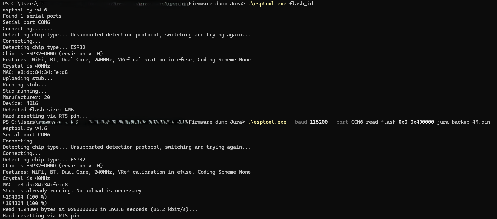

---------------------------------------------------------

3D Printed Housing

  

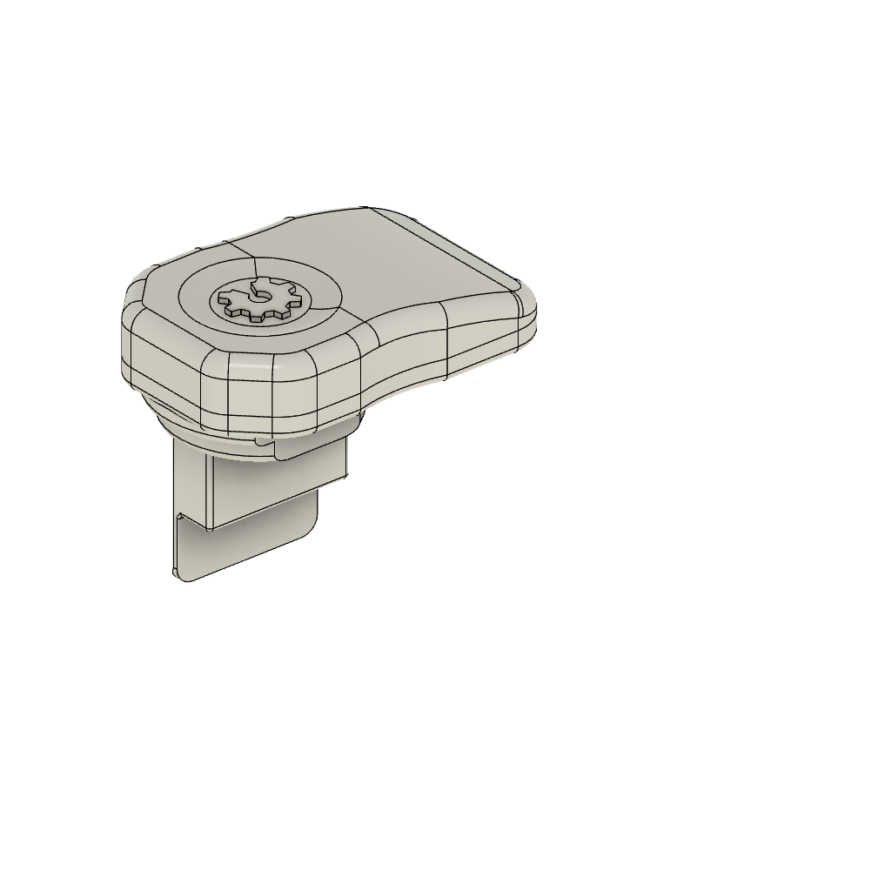
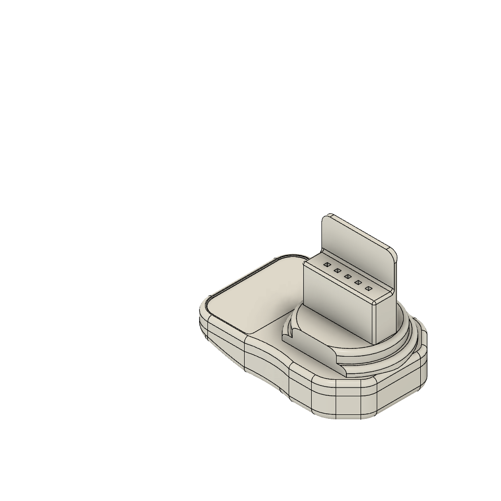
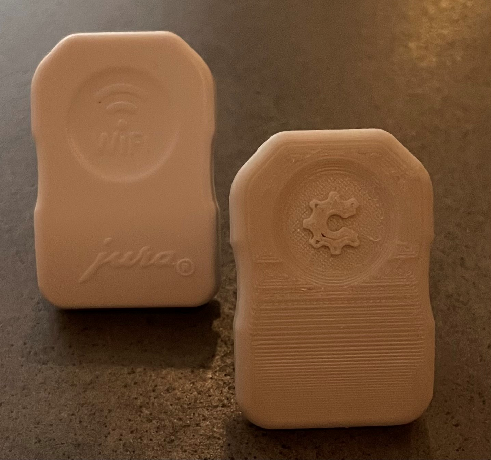
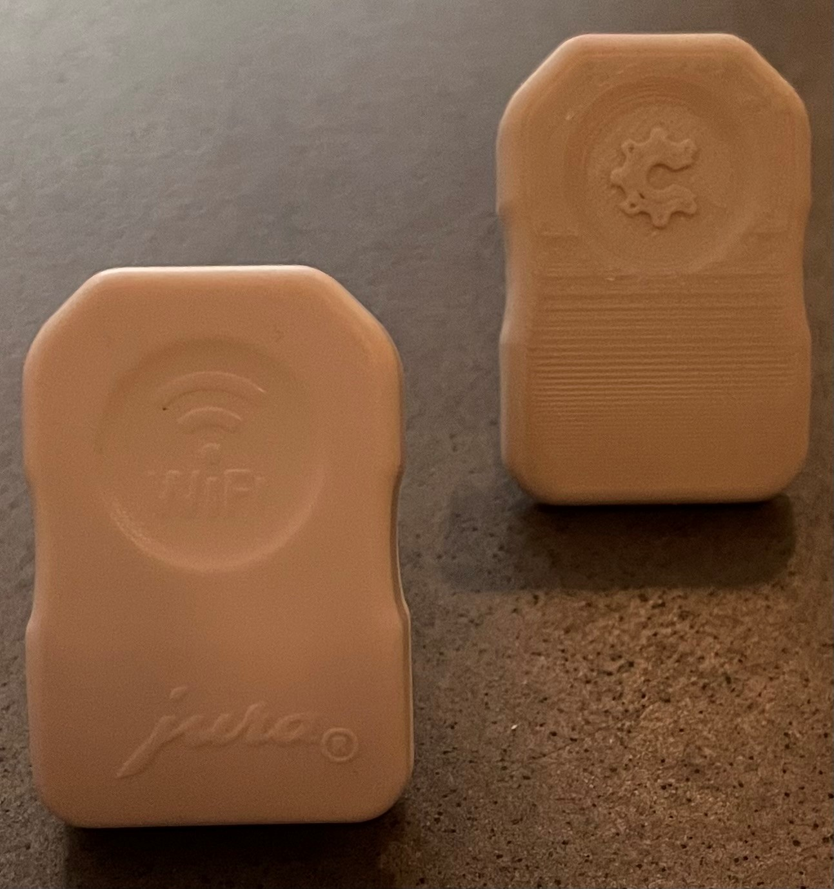
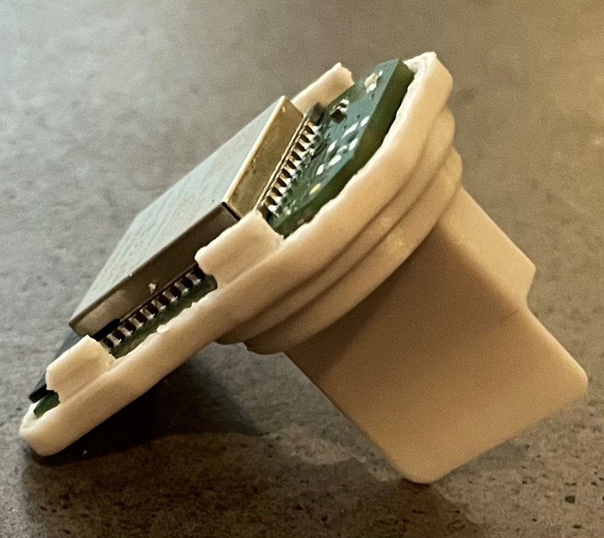
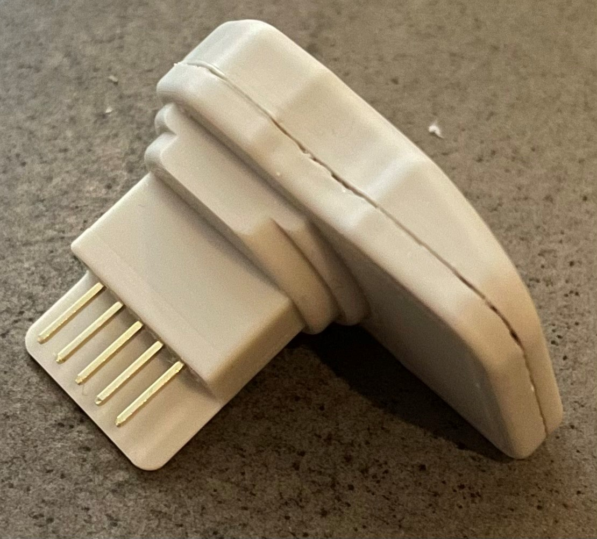
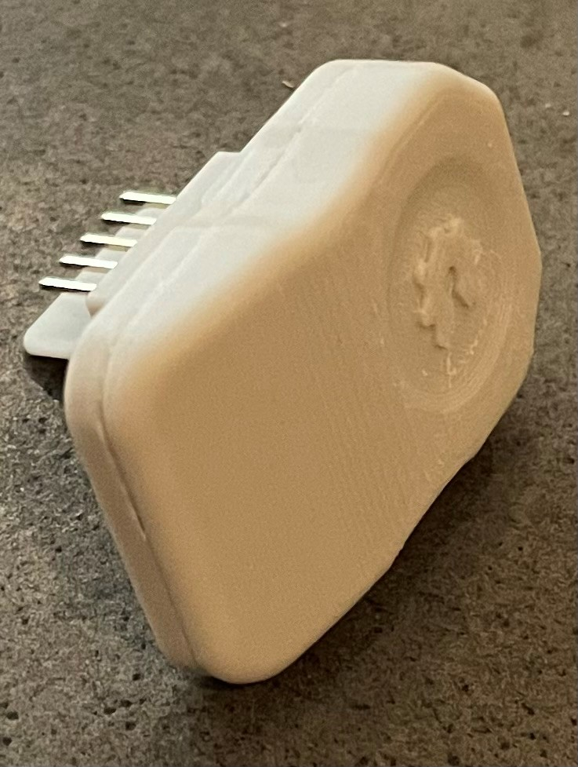
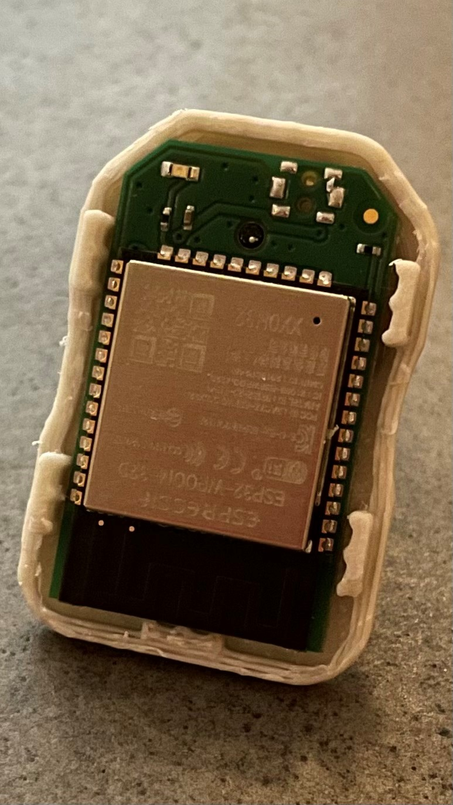

---------------------------------------------------------

PCB Reverse Engineered

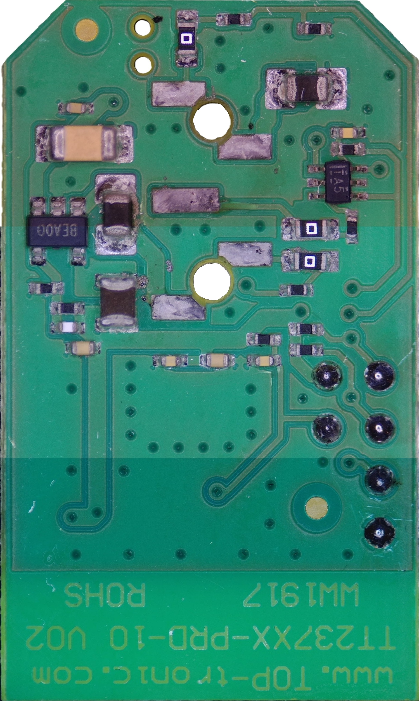
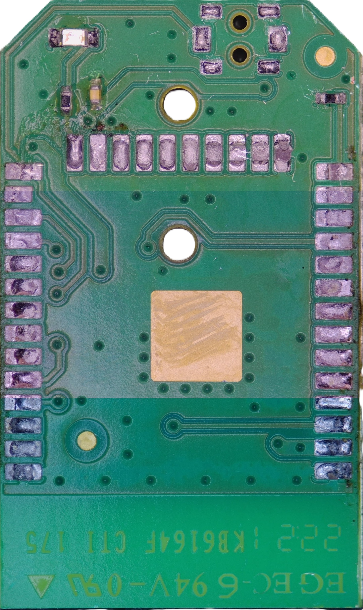
